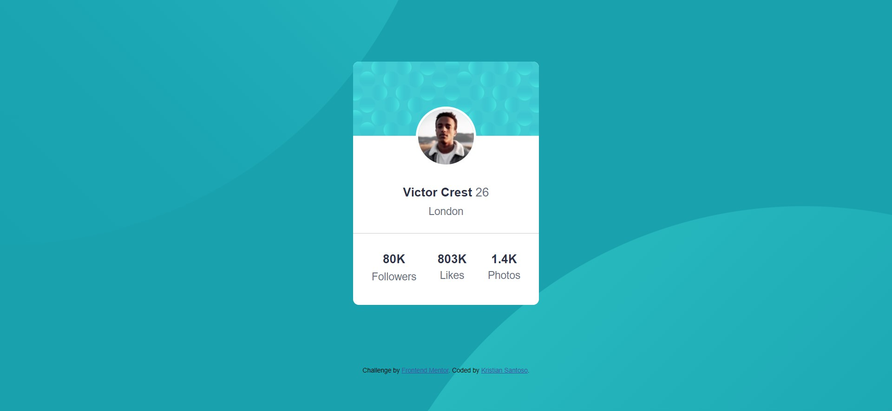
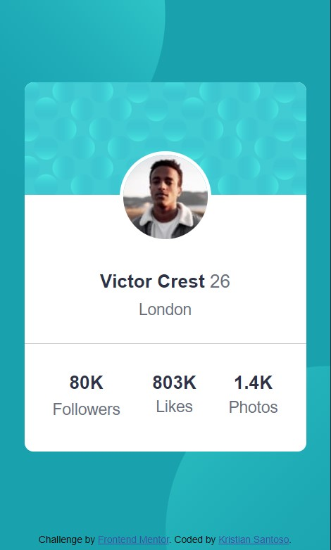

# Frontend Mentor - Profile card component solution

This is a solution to the [Profile card component challenge on Frontend Mentor](https://www.frontendmentor.io/challenges/profile-card-component-cfArpWshJ). Frontend Mentor challenges help you improve your coding skills by building realistic projects. 

## Table of contents

- [Overview](#overview)
  - [The challenge](#the-challenge)
  - [Screenshot](#screenshot)
  - [Links](#links)
- [My process](#my-process)
  - [Built with](#built-with)
  - [What I learned](#what-i-learned)
  - [Continued development](#continued-development)
  - [Useful resources](#useful-resources)
- [Author](#author)
- [Acknowledgments](#acknowledgments)

## Overview

### The challenge

- Build out the project to the designs provided

### Screenshot

 & 

This is final result for my challenges. 

### Links

- Solution URL: (https://github.com/kristiansnts/frontend-mentor-profile-card-component)

## My process

The first thing is i'm layouting the page.
i break down the design, where the background and where the main card.

first thing i do is code the background and that is the hardest part because not just i fit it to desktop but to mobile too.
this is the first time i do responsive.

i separate styling css  and  in different file to make my styling css file not to much code.

but before i code the background, i manage the assets first.
i make costum properties in root css and the data i get from style-guide.md .

i code this solution with concept cleaner code.
as clean as posible.

### Built with

- Semantic HTML5 markup
- CSS custom properties
- Flexbox
- Mobile-first workflow

### What I learned

many thing i learn from this project

but most important thing that i learn is:

i learn multiple background and multiple background position and apply it to responsive

""
body {
    background-color: hsl(185, 75%, 39%);
    background-image: url(images/bg-pattern-top.svg), url(images/bg-pattern-bottom.svg);
    background-size: 100%, 100%;
    background-repeat: no-repeat, no-repeat;
    background-position: -48vw 50%, 50vw -176%;
}

@media (min-width: 375px) {
    body {
        background-position: -50vw -70%, 50vw 170%;
    }
}

@media (min-width: 425px) {
    body {
        background-position: -50vw -100%, 50vw 220%;
    }
}

@media (min-width: 768px) {
    body {
        background-position: -50vw 275%, 50vw -215%;
    }
}

@media (min-width: 1024px) {
    body {
        background-position: -50vw 150%, 50vw -65%;
    }
}

@media (min-width: 1440px) {
    body {
        background-position: -50vw 125%, 40vw -40%;
    }
}
""

### Continued development

need to learn flexbox and css grid for easy and clean layouting. 
i need to learn more so my code can so clean and not to messy

### Useful resources

- [Web Programing Unpas](https://www.youtube.com/@sandhikagalihWPU/playlists?view=50&shelf_id=2) - My main course and this course open my mind.
- [w3school, mdn](https://www.w3schools.com/)(https://developer.mozilla.org/en-US/), - my refferences
- [stack overflow](https://stackoverflow.com/) - place where i search solution

